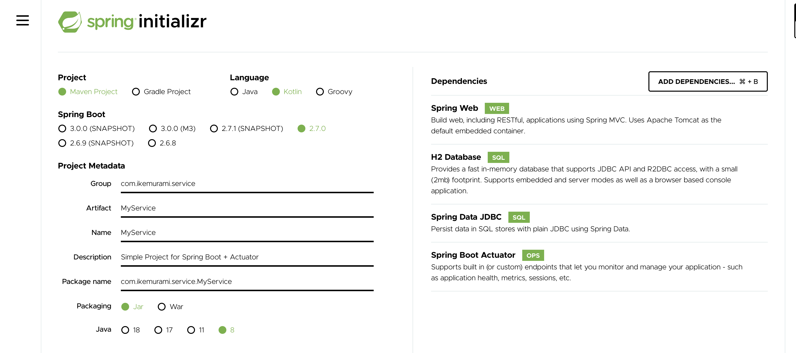

# Kotlin Spring Server + Actuator

Пример Kotlin-приложения, написанного с использованием Spring Framework + Actuator. Сборка и запуск происходит в докер контейнере.

Spring: https://spring.io/  
Tutorial: https://kotlinlang.org/docs/jvm-spring-boot-restful.html  

# Create app

Есть специальный сайт-конфигуратор Spring приложений: https://start.spring.io/

Выбираем: Spring Boot, Maven, Kotlin и зависимости как на изображении:



Жмем Generate и скачиваем наш проект. Далее распаковываем.

# Run

Запуск локально (Maven):

```
mvm install
mvm spring-boot:run
```

Порт можно установить здесь (сейчас 8080): ./src/main/resources/application.properties

Go to http://localhost:8080/actuator

Запуск в docker:

```
cd deploy
docker compose build
docker compose up
```

Go to http://localhost:8081/actuator

# About actuator

The only two available by default are /health and /info.

Для открытия всех ендпоинтов в конфиге проставляем:

./src/main/resources/application.properties:

```
management.endpoints.web.exposure.include=*
```

Other not secure settings:

```
management.endpoint.env.post.enabled=true
management.endpoint.restart.enabled=true
endpoints.sensitive=true
endpoints.actuator.enabled=true
management.security.enabled=false 
management.endpoints.web.exposure.include=*
```