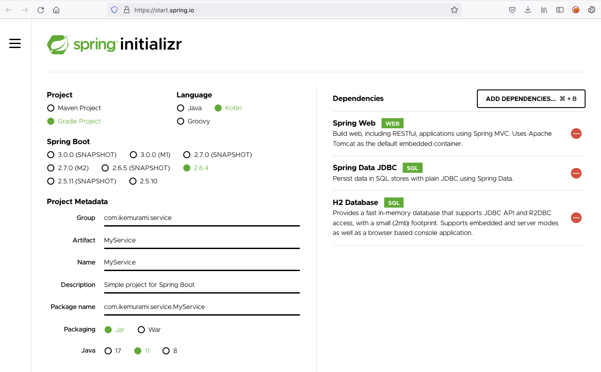

# Kotlin Spring Server

Пример Kotlin-приложения, написанного с использованием Spring Framework. Сборка и запуск происходит в докер контейнере.

Spring: https://spring.io/  
Tutorial: https://kotlinlang.org/docs/jvm-spring-boot-restful.html  

# Create app

Есть специальный сайт-конфигуратор Spring приложений: https://start.spring.io/

Выбираем: Spring Boot (2.6.4), Gradle, Kotlin и зависимости как на изображении:



Жмем Generate и скачиваем наш проект. Далее распаковываем.

Формируем Docker-файл (`Dockerfile`), скрипт для сборки контейнера (`build_service_prod.sh`).  

# Run

Запуск локально (все доступные таски — `./gradlew tasks`):

```
./gradlew bootRun
```

Сборка для прода:

```
./gradlew bootJar
```

# Build and run in docker

(Образ `adoptopenjdk/openjdk11` соответствует 11 версии Java)

```
sh build_and_run.sh
```

И переходим на http://127.0.0.1:8080/